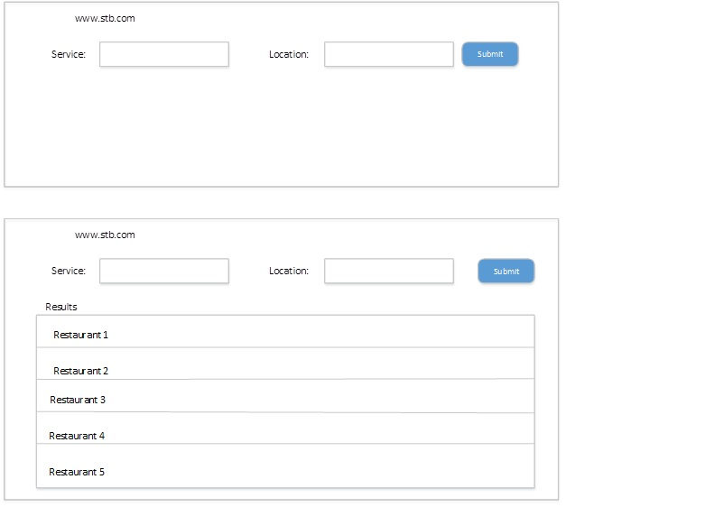
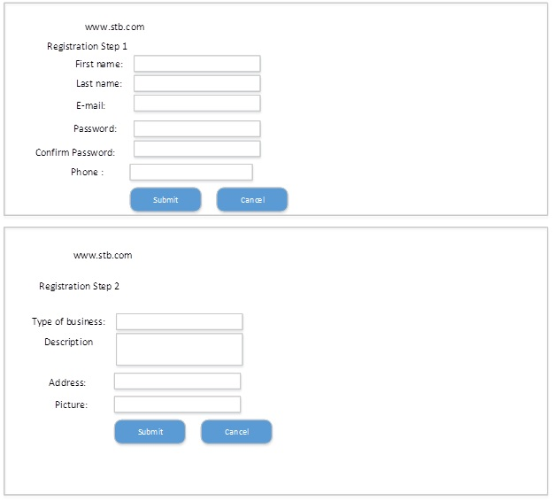
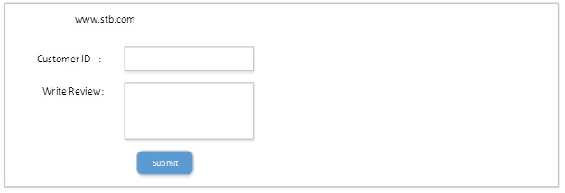

<html>
<body>
<h2 align='center' >Tri State Businesses (TSB)</h2>

<h4>Mission statement:</h4>

 The purpose of TSB is to build a database which stores the local businesses data in a directory which will be accessed by the clients/customers using web application. This directory will make it easier for the clients to find the interesting businesses and will also help the businesses to be easily available and accessed by huge customer base of this directory. People can also rate a business or write a review of a business.

<h4>Goal:</h4>
 The goal is to provide an ability to the local business owners(in tri states) to publish their businesses on the website/app and respond to customer reviews. At the same time, allow the customers to search for the local businesses and write the experience in form of reviews.
<h4>Users:</h4>
   Local business owners and customers.
  
  <h4>Scope:</h4>
 <ol>
     <li> Provide a platform for the customers to search local businesses for their individual needs like a saloon, restaurant, pet grooming parlors etc.</li>
     <li> Allow the customers to write reviews about their experience at a particular business</li>
     <li> Allow the local businesses to publish their business information</li>
     <li> Allow the businesses to respond to the reviews</li>
    <li> Website/App to reflect all reviews of the businesses correctly that will enable the customer to decide the right place to visit</li>
     <li> Extend training to local businesses to effectively respond to negative feedbacks from customers</li>
     <li> Monitor and reduce fake reviews about the businesses</li>
</ol>
<h5>Scenario 1:</h5> 
A customer is looking for a restaurant to have lunch. 
He/she opens TSB.com enters the service and location. TSB displays the list of restaurants, their description, address, contact information, website address and the reviews.
<h5>Scenario 2:</h5>
A business owner wants to register the business with TSB.com.  
Business owner needs to create an account with TSB.com and can enter the business category, description, address, pictures, website url, contact information etc.
<h5>Scenario 3:</h5>
A customer visited a restaurant and wants to write a review about it. 
Customer opens TSB.com goes to reviews section where he will be asked for customer ID provided by business owner.( this ID avoids the fake reviews). He /she will be given an option to write a review, TSB stores the review for that business so that other customers can view it. This review will in pending status for 20 days so that the Business owner can take action.

<h5>Scenario 4:</h5>
A Business owner wants to chek the reviews before TBS publishes. 
Business owner can view the pending reviews.He/she can sort out the issue with customer and ask them go back and change the review, else business owner can just respond to the review within 10 days.
 
 
<h5>Mockups:</h5>

<h6>Scenario 1:Search & Search Results</h6>

<h6>Scenario 2:Business Owners Registration</h6>

<h6>Scenario 3:Write Review or update review</h6>

<h6>Scenario 4:Business Owner response to review</h6>
    
